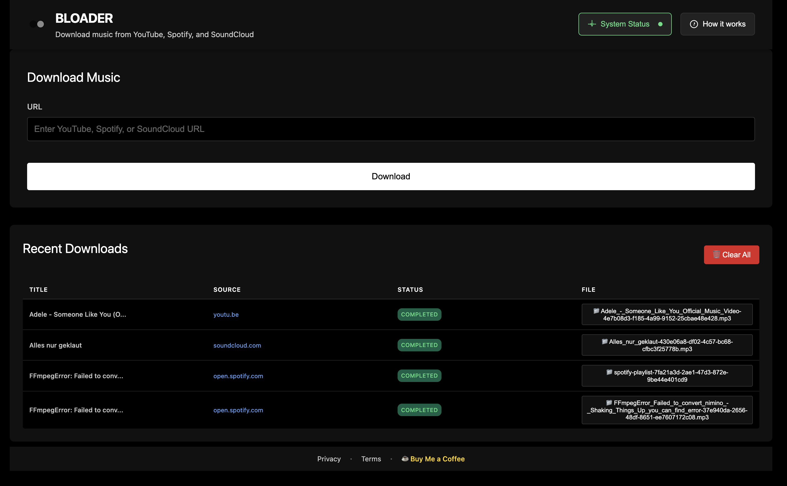

# 🎵 Music Downloader

**Download music from YouTube, Spotify, and SoundCloud with ease**

> ⚠️ **LEGAL WARNING**: This software is for educational and personal convenience only. Users are solely responsible for complying with all applicable copyright laws and regulations. The developers are not liable for any illegal use of this tool.

A beautiful, privacy-focused desktop application that enables us to use existing music downloader libraries with a more comfortable UI. Built with modern technologies and designed for simplicity.



## ✨ Features

### 🎯 **Core Functionality**
- **YouTube Music** - Download any YouTube video as MP3
- **Spotify Tracks** - Convert Spotify links to downloadable audio
- **SoundCloud Audio** - Download SoundCloud tracks and playlists
- **High Quality** - All downloads converted to MP3 with FFmpeg
- **Smart Naming** - Files saved with original titles and unique IDs

### 🎨 **User Experience**
- **Modern Interface** - Clean, responsive design with dark theme
- **Real-time Progress** - Live download status and progress bars
- **Download History** - Track all your downloads with status
- **File Management** - Direct access to downloaded files
- **System Status** - Monitor API server and tool availability

### 🔒 **Privacy & Security**
- **Local Processing** - All downloads happen on your device
- **No Data Collection** - We don't store or transmit your data
- **Open Source** - Transparent code you can inspect
- **Offline Capable** - Works without internet after setup
- **Legal Compliance** - Designed for personal use only
- **Copyright Respect** - Users must comply with applicable laws

### 🚀 **Advanced Features**
- **Playlist Support** - Download entire playlists automatically
- **Error Recovery** - Automatic retry and error handling
- **File Verification** - Ensures downloads complete successfully
- **Cross-Platform** - Works on macOS, Windows, and Linux

## 🎯 Quick Start

### For Users
1. **Download** the latest release for your platform
2. **Install** the application
3. **Paste a URL** from YouTube, Spotify, or SoundCloud
4. **Click Download** and enjoy your music!

### For Developers
```bash
# Clone the repository
git clone https://github.com/mholetzko/downloader.git
cd downloader/electron-app

# Install dependencies
npm install
pip install -r api/requirements.txt

# Download FFmpeg (automatically done during build)
npm run download-ffmpeg

# Start development
npm run dev
```

## 📱 Supported Platforms

| Platform | Status | Download |
|----------|--------|----------|
| **macOS** | ✅ Ready | [Latest Release](https://github.com/mholetzko/downloader/releases) |
| **Windows** | 🚧 Coming Soon | - |
| **Linux** | 🚧 Coming Soon | - |

## 🎵 Supported Services

### YouTube
- ✅ **Music videos**
- ✅ **Audio-only content**
- ✅ **Playlists** (coming soon)

### Spotify
- ✅ **Individual tracks**
- ✅ **Playlists** (with rate limiting)
- ✅ **Album tracks**
- ⚠️ **Rate limited** - may take longer

### SoundCloud
- ✅ **Public tracks**
- ✅ **Public playlists**
- ⚠️ **Public content only**

## 📁 File Organization

Downloaded files are automatically organized in your Downloads folder:

```
~/Downloads/music-downloader/
├── Song Title-abc123.mp3
├── Another Song-def456.mp3
└── Playlist Name/
    ├── Track 1-ghi789.mp3
    ├── Track 2-jkl012.mp3
    └── ...
```

## 🔧 System Requirements

- **Operating System**: macOS 10.15+ (Catalina or later)
- **Memory**: 4GB RAM minimum
- **Storage**: 500MB free space
- **Internet**: Required for downloads
- **Permissions**: File system access for downloads

## 🆘 Getting Help

### Common Issues
- **App won't start**: Check if it's in Applications folder, right-click and "Open"
- **Downloads not working**: Ensure internet connection and API server is running
- **Permission errors**: Check system preferences for app permissions

### Legal & Responsible Use
- **Personal use only** - Do not use for commercial purposes
- **Respect copyright** - Only download content you have permission to access
- **Local processing** - All downloads stay on your device
- **No DRM circumvention** - This tool does not bypass copyright protections and just leverage existing open source libraries
- **Legal compliance required** - Users must comply with all applicable laws
- **No illegal downloads** - Do not download copyrighted content without permission
- **Terms of service** - Respect platform terms of service
- **Independent legal review** - Users must determine legality themselves
- **No warranty** - Use at your own risk and responsibility

### Support Resources
- 📖 **[Installation Guide](INSTALLATION_GUIDE.md)** - Detailed setup instructions
- 🔧 **[Troubleshooting](TROUBLESHOOTING.md)** - Common problems and solutions
- 📋 **[Changelog](CHANGELOG.md)** - Version history and updates

## 🛠️ Technical Documentation

For developers and contributors:

- **[Frontend Architecture](src/README.md)** - Electron app structure and components
- **[API Documentation](api/README.md)** - Python backend and endpoints
- **[Build Process](scripts/)** - Build scripts and automation

## 🤝 Contributing

We welcome contributions! Please see our contributing guidelines:

1. **Fork** the repository
2. **Create** a feature branch
3. **Make** your changes
4. **Test** thoroughly
5. **Submit** a pull request

## 📄 License

This project is licensed under the MIT License - see the [LICENSE](LICENSE) file for details.

## 🙏 Acknowledgments

This project combines multiple **existing, open-source tools** into a single, user-friendly interface for educational and personal convenience purposes:

- **yt-dlp** - YouTube downloading engine (Unlicense)
- **spotdl** - Spotify downloading library (MIT License)
- **scdl** - SoundCloud downloading tool (MIT License)
- **FFmpeg** - Audio processing and conversion (LGPL)
- **Electron** - Cross-platform desktop framework (MIT License)
- **FastAPI** - Modern Python web framework (MIT License)

**Important Legal Note**: This project is designed to provide a unified interface for existing downloading tools. It does not add any new downloading capabilities beyond what these tools already provide. All underlying tools are open-source and designed for legitimate use cases. Users must ensure their use complies with applicable laws and platform terms of service.


## ⚖️ Legal Disclaimer & Terms of Use

**⚠️ IMPORTANT: READ THIS SECTION CAREFULLY BEFORE USING THIS SOFTWARE**

### 🚨 **DISCLAIMER OF LIABILITY**
**THE DEVELOPERS OF THIS SOFTWARE ARE NOT RESPONSIBLE FOR ANY ILLEGAL USE OF THIS TOOL. USERS ARE SOLELY RESPONSIBLE FOR COMPLYING WITH ALL APPLICABLE LAWS AND COPYRIGHT REGULATIONS.**

### 📋 **LEGAL TERMS OF USE**
By using this software, you agree to:
- **Use this tool only for legal purposes**
- **Download only content you have explicit permission to access**
- **Comply with all applicable copyright laws and regulations**
- **Not use this tool to circumvent any DRM or copyright protections**
- **Accept full responsibility for your actions**

### 🎯 **INTENDED LEGAL USE ONLY**
This software is designed for:
- **Personal use only** - Download content you have legal access to
- **Educational purposes** - Learn about music downloading technologies
- **Convenience** - Merge multiple downloader tools into one interface
- **Local processing** - All downloads happen on your device
- **Content you own** - Download your own content from platforms
- **Public domain content** - Download freely available content
- **Creative Commons content** - Download content with appropriate licenses

### ❌ **PROHIBITED USES**
**DO NOT USE THIS SOFTWARE TO:**
- Download copyrighted content without permission
- Circumvent DRM or copyright protections
- Download content for commercial distribution
- Violate any terms of service of content platforms
- Download content that infringes on intellectual property rights
- Use for any illegal or unauthorized purpose

### 🛡️ **LEGAL PROTECTIONS**
- **No warranty** - Software provided "as is" without any warranties
- **No liability** - Developers not liable for any damages or legal issues
- **User responsibility** - Users bear full responsibility for their actions
- **No endorsement** - Use of this tool does not constitute legal advice
- **Independent use** - Each user must determine legality independently

### 📚 **LEGAL RESOURCES**
Before using this software, familiarize yourself with:
- **Copyright laws** in your jurisdiction
- **Terms of service** of content platforms
- **Fair use** provisions (if applicable)
- **DMCA** regulations and compliance
- **Local laws** regarding digital content

**⚠️ IF YOU ARE UNSURE ABOUT THE LEGALITY OF DOWNLOADING CERTAIN CONTENT, DO NOT USE THIS TOOL. CONSULT WITH A LEGAL PROFESSIONAL.**

## ☕ Support the Project

If you find this tool useful, consider buying us a coffee:

[](https://www.buymeacoffee.com/mholetsgo)

---
